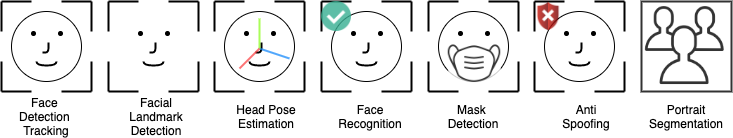
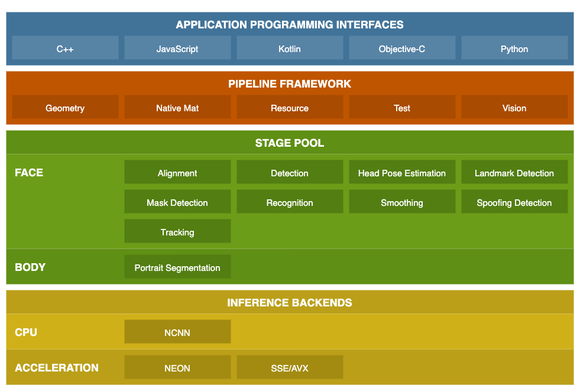

# CLOVA Face Kit

:point_right: [Go to Release Page](../../releases) to download the artifacts.

## Introduction

CLOVA Face Kit (also known as CLOVA SEE) is an easy-to-use vision analysis SDK. The key features are as below;
- __On Device AI__ solution
- Support cross-platform (Android, iOS, Linux, macOS, Windows)
- Features

    

## Overview

<p float="left">
  
</p>

## ⚡ Have a try ⚡
- Android
- iOS
- Python
- ️Web Browser (WASM)

## Documents
- [How-To-Use](docs/how-to-use)
- API Document

## Performance
### Model's Latency (Single Thread)   

| Device | Face Detection | Facial Landmark Detection<br/>(5point) | Facial Landmark Detection<br/>(106point) | Face Recognition | Mask Detection | Portrait Segmentation |
|:-:|:-:|:-:|:-:|:-:|:-:|:-:|
| Pixel 3   | 8.6 ms | 0.8 ms | 7.5 ms | 14.0 ms | 0.4 ms | 20 ms |
| Galaxy S7 | 8.9 ms | 1.9 ms | 14.2 ms | 27.3 ms | 0.9 ms | 39 ms |
| iPhone 6  | 8.5 ms | 1.9 ms | 15.8 ms | 28.9 ms | 0.9 ms | 38 ms |
| iPhone 7 	| 3.0 ms | 0.7 ms | 5.8 ms | 14.7 ms | 0.4 ms | 17 ms |
| i7-4770hq | 5.1 ms | 0.5 ms | 9.2 ms | 9.4 ms | 0.4 ms | 12 ms |

## Version Convention

A version in [/releases] follows [HeadVer](https://github.com/line/headver) convention, `{head}.{yearweek}.{build}` convention, but the last digit is omitted due to various build numbers on each platform. For example, `0.2134` stands for a released artifacts of version `0` in `34th` week of `2021`.

## License

```
Copyright (c) 2021-present NAVER Corp.

Licensed under the Apache License, Version 2.0 (the "License");
you may not use this file except in compliance with the License.
You may obtain a copy of the License at

    http://www.apache.org/licenses/LICENSE-2.0

Unless required by applicable law or agreed to in writing, software
distributed under the License is distributed on an "AS IS" BASIS,
WITHOUT WARRANTIES OR CONDITIONS OF ANY KIND, either express or implied.
See the License for the specific language governing permissions and
limitations under the License.
```
