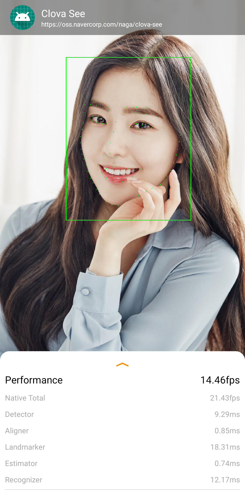
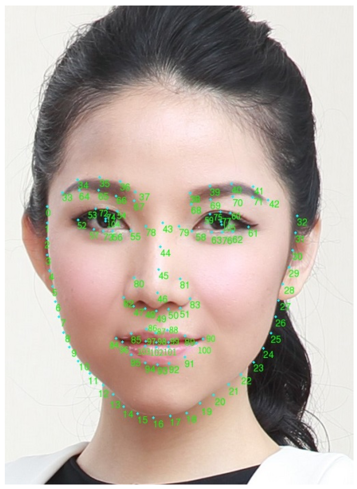
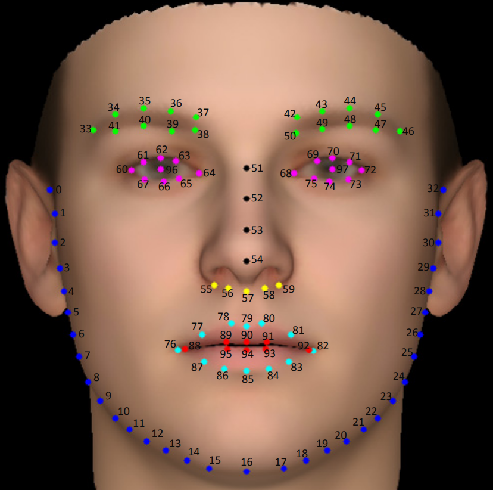
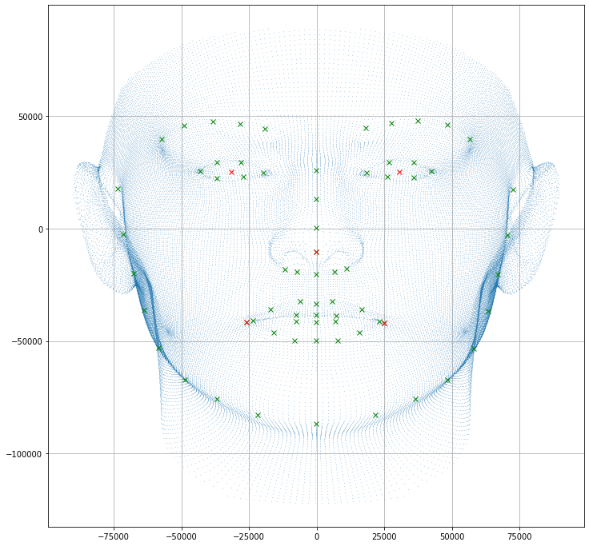

# Quick Developer Guide to CLOVA SEE for C++

## 예제 프로젝트

CLOVA SEE의 적용법과 사용법은 [examples/opencv_highgui](../../examples/opencv_highgui)를 참고해주세요.

## 간단 사용법

1. `ClovaSee` 객체를 생성합니다. `ClovaSee` 객체를 생성할 때는 `Settings`를 통해서 몇 가지 세부 옵션을 설정할 수 있는데 이 부분은 다음 절에서 설명합니다.

   ```C++
   #include "base/settings.h"
   #include "sdk/clova_see.h"
   
   int main(int argc, char* argv[]) {
     const auto settings = clova::SettingsBuilder()
         .Build();
     clova::ClovaSee clova_see(settings);

     ...

     return EXIT_SUCCESS;
   }
   ```

2. `ClovaSee`로 분석할 이미지를 `Frame`으로 만들어 준비합니다. 아래는 OpenCV에서 얻은 이미지를 `Frame`으로 만드는 예입니다.

   ```C++
   #include <opencv2/imgproc.hpp>
   #include <opencv2/videoio.hpp>

   #include "base/frame.h"

   clova::Frame::Format ToFrameFormat(const cv::Mat& mat) {
     switch (mat.type()) {
       case CV_8UC3:
         return clova::Frame::Format::kBGR_888;
       default:
         return clova::Frame::Format::kUnknown;
     }
   }

   clova::Frame ToFrame(const cv::Mat& mat) {
     return clova::Frame(mat.data, mat.cols, mat.rows, ToFrameFormat(mat));
   }

   int main(int argc, char* argv[]) {

     ...

     cv::VideoCapture video_capture;
     cv::Mat snapshot;
     capturer >> snapshot;

     const auto& frame = ToFrame(snapshot);

     ...

     return EXIT_SUCCESS;
   }
   ```

3. `Frame`에 있는 얼굴에서 어떠한 정보들을 분석할 것인지, 조건을 설정할 것인지 `clova::face::OptionsBuilder()` 를 이용하여 `clova::face::Options`을 설정합니다. `clova::face::Options`에서 설정할 수 있는 옵션들은 마지막 절에서 설명합니다.
   ```C++
      #include "base/face.h"
   
      int main(int argc, char* argv[]) {
   
        ...
        const auto& options = clova::face::OptionsBuilder()
            .SetBoundingBoxThreshold(0.7f)
            .SetInformationToObtain(clova::face::Options::kCountours |
                                    clova::face::Options::kEulerAngles |
                                    clova::face::Options::kMasks)
            .SetMinimumBoundingBoxSize(0.1f)
            .SetResizeThreshold(320)
            .Build();
        ...
   
        return EXIT_SUCCESS;
      }
      ```

4. 2에서 준비한 `Frame`과 3에서 준비한 `clova::face::Options`을  가지고 `ClovaSee::run()`을 호출합니다. `ClovaSee::run()`은 주어진 `Frame`에 있는 얼굴 정보를 분석해서 결과를 `Faces`(`std::vector<Face>`)에 담아 반환합니다. `Face`에 반환되는 정보는 마지막 절에서 설명합니다. 

   ```C++
   #include "base/face.h"

   int main(int argc, char* argv[]) {

     ...
     const auto& faces = clova_see.Run(frame, options);

     ...

     return EXIT_SUCCESS;
   }
   ```

5. 4에서 반환된 `Faces`를 가지고 원하는 작업을 합니다. 아래는 OpenCV HighGui를 써서 화면에 얼굴 정보를 그리는 예입니다.

   ```C++
   #include <opencv2/highgui.hpp>

   cv::Point ToCvPoint(const clova::Point& point) {
     return cv::Point(point.x(), point.y());
   }

   cv::Rect ToCvRect(const clova::Rect& rect) {
     return cv::Rect(rect.x(), rect.y(), rect.width(), rect.height());
   }

   void DrawBoundingBox(cv::Mat& canvas, const clova::Face& face) {
     static cv::Scalar kColor(0, 0, 255, 0);
     static int kThickness = 2;
     cv::rectangle(canvas, ToCvRect(face.bounding_box()), kColor, kThickness);
   }

   void DrawContour(cv::Mat& canvas, const clova::Face& face) {
     static cv::Scalar kColor(0, 255, 0, 0);
     static int kRadius = 1;
     for (const auto point : face.contour().points)
       cv::circle(canvas, ToCvPoint(point), kRadius, kColor);
   }

   int main(int argc, char* argv[]) {

     ...

     for (const auto& face : faces) {
       DrawBoundingBox(snapshot, face);
       DrawContour(snapshot, face);
     }

     cv::imshow("OpenCV HighGui Example", snapshot);

     ...

     return EXIT_SUCCESS;
   }
   ```

## 세부 옵션 설정 방법

`ClovaSee` 객체를 생성할 때 첫 번째 매개변수에 `Settings` 객체를 전달하면 `ClovaSee`의 동작 방식과 관련된 몇 가지 세부 옵션을 제어할 수 있습니다. `Settings` 객체는 보통 `SettingsBuilder`를 통해서 만드는데, 사용 예와 주요 옵션의 의미는 아래와 같습니다.

```C++
const auto settings = clova::SettingsBuilder()
    .SetNumberOfThreads(4)
    .SetIntermittentInformationRatio(1)
    .SetPerformanceMode(clova::Options::PerformanceMode::kAccurate106)
    .Build();
clova::ClovaSee clova_see(settings);
```

1. `SettingsBuilder::SetNumberOfThreads()`: `ClovaSee` 내부의 스레드 풀 크기를 설정합니다. 보통 실행 환경에 장착된 코어의 수(Big-Little 구조의 경우에는 Big의 수)로 설정하며, 기본 값은 4입니다.

2. `SettingsBuilder::SetPerformanceMode()`: `ClovaSee`의 수행 속도와 반환되는 정보의 정확성 둘 중에 어떤 것이 더 중요한지를 설정합니다. 아래의 값들 중 하나를 설정하면 되며, 기본 값은 `Settings::PerformanceMode::kAccurate98`입니다. 현재 이 옵션으로 영향을 받는 반환 값은 `Face::contours` 뿐이지만 추후 확대될 수 있습니다.

   `Settings::PerformanceMode::kAccurate106`: `Face::contours`에 106개의 점으로 구성된 윤곽선 정보를 반환합니다.

   `Settings::PerformanceMode::kAccurate98`: `Face::contours`에 98개의 점으로 구성된 윤곽선 정보를 반환합니다.

   `Settings::PerformanceMode::kFast`: `Face::contours`에 5개의 점으로 구성된 윤곽선 정보를 반환합니다.

4. `SettingsBuilder::SetIntermittentInformationRatio()`: 얼굴 분석을 수행할 주기를 프레임 수 단위로 지정합니다. 기본 값은 1입니다. 예를 들어, 5를 지정하면 `SettingsBuilder::SetInformationToObtain()`으로 설정한 정보가 5프레임마다 한 번씩만 분석되어 반환됩니다. 단, `Settings::kBoundingBoxes`는 이 주기와 상관 없이 항상 반환됩니다. 이처럼 사용자가 설정한 주기에 따라서만 분석되어 반환되는 정보를 Intermittent Information이라고 하며, `Settings::kBoundingBoxes`를 제외한 나머지 모든 정보가 여기에 해당합니다.

## `clova::face::Options`

1. `OptionsBuilder::SetBoundingBoxThreshold()` : Face Detection에서 특정 confidence 값 이상인 경우에만 반환하도록 threshold를 설정합니다.

2. `OptionsBuilder::SetInformationToObtain()`: `ClovaSee`를 통해 알고자 하는 정보의 종류를 설정합니다. 아래의 값들 중 원하는 정보의 종류를 `|`로 묶어서 설정하면 됩니다. 필요한 정보의 종류만 간략하게 설정하면 `ClovaSee::run()`의 실행 시간을 줄이는데 도움이 됩니다. 기본 값은 `Options::kAll` 입니다.

   `Options::kBoundingBoxes`: 얼굴이 있는 영역의 좌표 정보를 반환합니다.

   `Options::kContours`: 얼굴의 윤곽선 정보를 반환합니다.

   `Options::kMasks`: 마스크 착용 여부를 반환합니다.

   `Options::kTrackingIDs`: 얼굴마다 ID를 할당해 반환합니다.

   `Options::kMojos`: `Mojo`라고 하는 얼굴 정보 값을 반환합니다. 일부 서비스에서만 사용하는 정보입니다.
   
   `Options::kSpoofs`: 얼굴이 진짜인지 가짜(디바이스, 프린트, 마스크)인지 여부를 반환합니다.

   `Options::kFeatures`: 얼굴의 특징 값을 반환합니다.

   `Options::kEulerAngles`: 얼굴이 향하고 있는 방향 정보를 X, Y, Z 값으로 반환합니다.

   `Options::kAll`: 위 여섯 가지 정보를 모두 반환합니다.

3. `OptionsBuilder::SetMinimumBoundingBoxSize()` : 이미지를 기준으로 Face Detection의 결과를 반환할 얼굴의 최소 크기를 설정합니다.

4. `OptionsBuilder::SetResizeThreshold()` : Face Detection의 입력으로 들어갈 이미지의 장축 사이즈를 설정합니다. 기본값은 320 입니다. 


## `Face`에 반환되는 정보

`ClovaSee::run()`은 전달된 `Frame`에 있는 얼굴을 분석한 뒤 그 결과를 `Faces`(`std::vector<Face>`)에 담아 반환합니다. `Face`에 반환되는 정보는 아래와 같습니다.

1. `Face::bounding_box()`: 얼굴이 있는 영역의 좌표 정보가 `Rect` 형식으로 반환됩니다. 아래의 그림 1에서 초록색 사각 영역에 해당하는 정보입니다.

2. `Face::contour()`: 얼굴의 윤곽선 정보가 `Contour` 형식으로 반환됩니다. 아래의 그림 1에서 얼굴의 윤곽선을 따라 그려진 점들에 해당하는 정보입니다.

   `Options::PerformanceMode::kAccurate106`: 106개의 점으로 구성된 윤곽선 정보가 반환됩니다. 점의 위치와 색인 정보는 그림 2와 같습니다.

   `Options::PerformanceMode::kAccurate98`: 98개의 점으로 구성된 윤곽선 정보가 반환됩니다. 점의 위치와 색인 정보는 그림 3와 같습니다.

   `Options::PerformanceMode::kFast`: 5개의 점으로 구성된 윤곽선 정보가 반환됩니다. 점의 위치는 그림 4에서 빨간 점에 해당합니다.

3. `Face::mojo()`: 일부 서비스에서만 사용하는 정보입니다.

4. `Face::feature()`: 얼굴의 특징 값이 `Feature` 형식으로 반환됩니다.

5. `Face::euler_angle()`: 얼굴이 향하고 있는 방향 정보가 `EulerAngle` 형식으로 반환됩니다.

   `EulerAngle::x()`, `EulerAngle::pitch()`: 정면을 응시한 상태에서 머리를 위아래로 움직일 때의 각입니다. 값의 범위는 -90도에서 90도이며, 아래로 움직일 때 음수가 반환됩니다.

   `EulerAngle::y()`, `EulerAngle::yaw()`: 정면을 응시한 상태에서 머리를 좌우로 움직일 때의 각입니다. 값의 범위는 -90도에서 90도이며, 왼쪽으로 움직일 때 음수가 반환됩니다.

   `EulerAngle::z()`, `EulerAngle::roll()`: 정면을 응시한 상태에서 머리를 좌우 어깨쪽으로 갸웃거리며 움직일 때의 각입니다. 값의 범위는 -90도에서 90도이며, 왼쪽 어깨쪽으로 움직일 때 음수가 반환됩니다.

6. `Face::tracking_id()`: 얼굴마다 할당된 고유의 ID가 `TrackingID` 형식으로 반환됩니다. 이 ID는 0부터 시작하며 항상 양수입니다.

7. `Face::mask()`: 마스크 착용 여부가 `Mask` 형식으로 반환됩니다. 이 형식은 `bool`과 동일합니다. `true`는 마스크 착용을, `false`는 마스크 미착용을 의미합니다.

8. `Face::spoof()`: 얼굴이 진짜인지 가짜인지 여부가 `Spoof` 형식으로 반환됩니다. 이 형식은 `bool`과 동일합니다. `true`는 가짜 얼굴을, `false`는 진짜 얼굴을 의미합니다.

<br/>
*그림 1*

<br/>
*그림 2*

<br/>
*그림 3*

<br/>
*그림 4*
