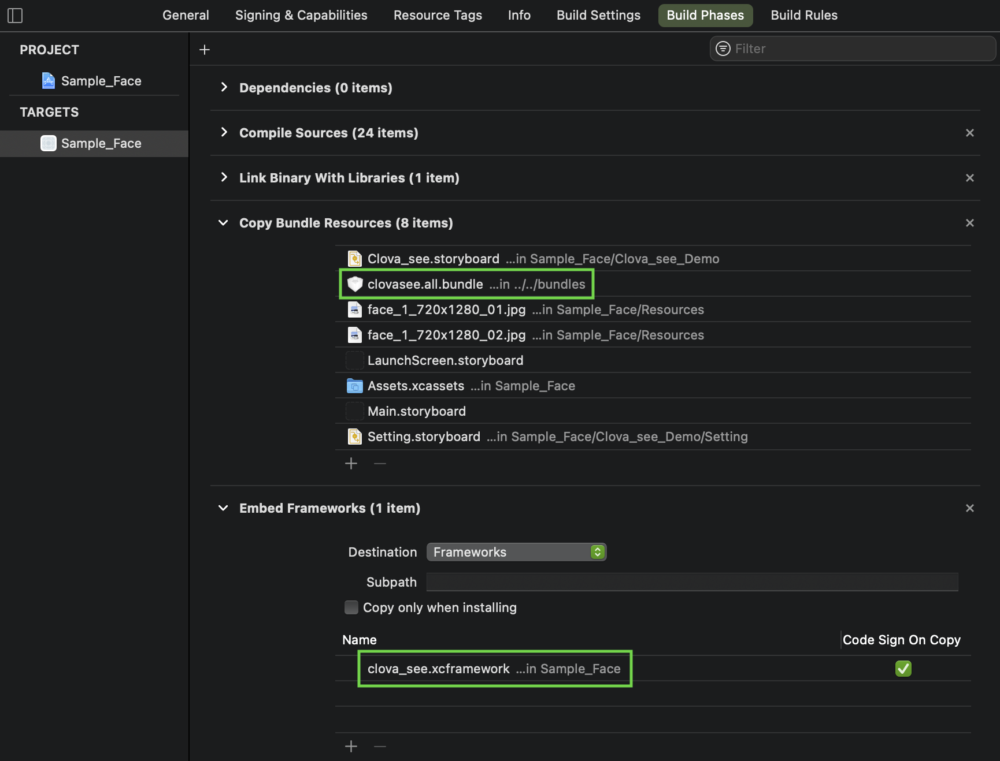

# Quick Developer Guide to CLOVA SEE for iOS

## 예제 프로젝트

CLOVA SEE의 적용법과 사용법은 [examples/ios](../../examples/ios)를 참고해주세요.
CLOVA SEE를 iOS Project에서 사용하려면, 아래의 절차를 따라주셔야 합니다.

1. [Release Page](../../releases) 로 이동합니다
2. clova_see.xcframework-{version}.zip 을 내려받아서, 압축을 풉니다.
3. 필요한 *.bundle 을 내려받습니다.
4. 2와 3에서 받은 파일들을, 아래의 사진과 같이 Xcode project 에 추가합니다.

<br/>

## 간단 사용법

1. `ClovaSeeWrapper` 객체를 생성합니다. `ClovaSeeWrapper` 객체를 생성할 때는 `CSOptions`를 통해서 몇 가지 세부 옵션을 설정할 수 있는데 이 부분은 다음 절에서 설명합니다.

   ```swift
    import clova_see

    let settings = CSSettingsBuilder()
    guard let clovaSee = ClovaSeeWrapper(settings: CSSettings(builder: settings)) else {
	   return
   }
   ```

2. `ClovaSeeWrapper`로 분석할 이미지를 `CSFrame`으로 만들어 준비합니다. `CVPixelBuffer`를 받아서 CSFrame의 형태로 만들어 줍니다.

   ```swift
        extension  ClovaSeeWrapper {
   		 func process(with pixelBuffer: CVPixelBuffer, completionHandler: @escaping    (Result<CSFace, Error>) -> Void) {
             guard let rgbPixelBuffer = pixelBuffer.convertBGRA8888toRGB888() else {
   	             completionHandler(.failure(ClovaSeeError.noPixelBuffer))
   	             return
             }
             let width = CVPixelBufferGetWidth(pixelBuffer)
             let height = CVPixelBufferGetHeight(pixelBuffer)
             CVPixelBufferLockBaseAddress(rgbPixelBuffer, CVPixelBufferLockFlags(rawValue: 0))
             defer {
   	             CVPixelBufferUnlockBaseAddress(rgbPixelBuffer,CVPixelBufferLockFlags(rawValue: 0))
   	         }

   	         guard let rgbDataPointer = CVPixelBufferGetBaseAddress(rgbPixelBuffer) else {
   	             return
   	         }
   	         let frame = CSFrame(pixels: rgbDataPointer,
   					 	        width: CGFloat(width),
   						        height: CGFloat(height),
   						        type: CSFrameFormatType.RGB888)
   	         let result = self.run(with: frame)
   	         completionHandler(.success(result))
   			 }
   		}
     ```

3. `CSFrame`에 있는 얼굴에서 어떠한 정보들을 분석할 것인지, 조건을 설정할 것인지 `CSFaceOptionsBuilder()` 를 이용하여 `clova::face::Options`을 설정합니다. `CSFaceOptions`에서 설정할 수 있는 옵션들은 마지막 절에서 설명합니다.
   ```swift
   import clova_see
   
   let options = CSFaceOptionsBuilder()
   options.boundingBoxThreshold = 0.7
   options.informationType = CSStageInformationType.contours.rawValue |
                             CSStageInformationType.masks.rawValue |
                             CSStageInformationType.eulerAngles.rawValue
   options.minimumBoundingBoxSize = 0.1
   options.resizeThreshold = 320
   ```


4. 2에서 준비한 `CSFrame`과 3에서 준비한 `CSFaceOptions`을 가지고 `clovaSee.runForFace()`을 호출합니다. `clovaSee.runForFace()`은 주어진 `CSFrame`에 있는 얼굴 정보를 분석해서 결과를 `CSFaceResult`에 담아 반환합니다. `CSFace`에 반환되는 정보는 마지막 절에서 설명합니다.

   ```swift
   import clova_see

   let faces = clovaSee.runForFace(with: frame, options: CSFaceOptions(builder: options))
   ```

5. 3에서 반환된 `CSFaceResult`를 가지고 원하는 작업을 합니다.

   ```swift
   import clova_see

   detector?.process(with: pixelBuffer) { [weak self] result in
       guard let self = self else { return }

       switch result {
       case .success(let faces):
           self.presenter?.removeCALayer()
           self.presenter?.presentFPS(1 / interval)
           self.presenter?.presentFaceBoxesWithMask(faces: faces, size: size)
           self.presenter?.presentFaceContours(faces: faces, size: size)
           self.presenter?.presentHeadPoses(faces: faces, size: size)
           if let capturedFace = self.capturedFace, let face = faces.first {
               self.presenter?.presentIsSameWithCapturedFace(
                   isSame: CSFace.isSame(withFace1: face,
                                         face2: capturedFace),
                   similarity: CSFace.getCosineSimilarity(withFace1: face,
                                                          face2: capturedFace))
           }
       case .failure(let error):
           self.presenter?.removeCALayer()
           print(error)
       }
   }
   ```

## 세부 옵션 설정 방법

`ClovaSeeWrapper` 객체를 생성할 때 두 번째 매개변수에 `CSSettings` 객체를 전달하면 `ClovaSeeWrapper`의 동작 방식과 관련된 몇 가지 세부 옵션을 제어할 수 있습니다. `CSSettings` 객체는 보통 `CSSettingsBuilder`를 통해서 만드는데, 사용 예와 주요 옵션의 의미는 아래와 같습니다.

```swift
import clova_see

let settings = CSSettingsBuilder()
settings.performanceMode = CSPerformanceModeType.accurate106
clovasee = ClovaSeeWrapper(settings: CSSettings(builder: settings))
```

1. `CSSettingsBuilder.performanceMode`: `ClovaSee`의 수행 속도와 반환되는 정보의 정확성 둘 중에 어떤 것이 더 중요한지를 설정합니다. 아래의 값들 중 하나를 설정하면 되며, 기본 값은 `CSPerformanceModeType.accurate98`입니다. 현재 이 옵션으로 영향을 받는 반환 값은 `Face.contours` 뿐이지만 추후 확대될 수 있습니다.

   `CSPerformanceModeType.accurate106`: `Face.contours`에 106개의 점으로 구성된 윤곽선 정보를 반환합니다.

   `CSPerformanceModeType.accurate98`: `Face.contours`에 98개의 점으로 구성된 윤곽선 정보를 반환합니다.

   `CSPerformanceModeType.fast`: `Face.contours`에 5개의 점으로 구성된 윤곽선 정보를 반환합니다.

2. `CSSettingsBuilder.intermittentInformationRatio`: 얼굴 분석을 수행할 주기를 프레임 수 단위로 지정합니다. 기본 값은 1입니다. 예를 들어, 5를 지정하면 `CSSettingsBuilderBuilder.setInformationToObtain()`으로 설정한 정보가 5프레임마다 한 번씩만 분석되어 반환됩니다. 단, `Options.BOUNDING_BOXES`는 이 주기와 상관 없이 항상 반환됩니다. 이처럼 사용자가 설정한 주기에 따라서만 분석되어 반환되는 정보를 Intermittent Information이라고 하며, `Options.BOUNDING_BOXES`를 제외한 나머지 모든 정보가 여기에 해당합니다.

## `CSFaceOptions` 

1. `CSFaceOptionsBuilder.boundingBoxThreshold` : Face Detection에서 특정 confidence 값 이상인 경우에만 반환하도록 threshold를 설정합니다. 

2. `CSFaceOptionsBuilder.informationType`: `ClovaSee`를 통해 알고자 하는 정보의 종류를 설정합니다. 아래의 값들 중 원하는 정보의 종류를 `or`로 묶어서 설정하면 됩니다. 필요한 정보의 종류만 간략하게 설정하면 `ClovaSee.run()`의 실행 시간을 줄이는데 도움이 됩니다. 기본 값은 `Options.ALL` 입니다.

   `CSStageInformationType.boundingBoxes`: 얼굴이 있는 영역의 좌표 정보를 반환합니다.

   `CSStageInformationType.contours`: 얼굴의 윤곽선 정보를 반환합니다.

   `CSStageInformationType.masks`: 마스크 착용 여부를 반환합니다.

   `CSStageInformationType.trackingIDs`: 얼굴마다 ID를 할당해 반환합니다.

   `CSStageInformationType.mojos`: `Mojo`라고 하는 얼굴 정보 값을 반환합니다. 일부 서비스에서만 사용하는 정보입니다.
   
   `CSStageInformationType.spoofs`: 얼굴이 진짜인지 가짜(디바이스, 프린트, 마스크)인지 여부를 반환합니다.

   `CSStageInformationType.features`: 얼굴의 특징 값을 반환합니다.

   `CSStageInformationType.eulerAngles`: 얼굴이 향하고 있는 방향 정보를 X, Y, Z 값으로 반환합니다.

   `CSStageInformationType.all`: 위 여섯 가지 정보를 모두 반환합니다.

3. `CSFaceOptionsBuilder.minimumBoundingBoxSize` : 이미지를 기준으로 Face Detection의 결과를 반환할 얼굴의 최소 크기를 설정합니다.
  
4. `CSFaceOptionsBuilder.resizeThreshold` : Face Detection의 입력으로 들어갈 이미지의 장축 사이즈를 설정합니다. 기본값은 320 입니다.

## `CSFace`에 반환되는 정보

`ClovaSee.run()`은 전달된 `CSFrame`에 있는 얼굴을 분석한 뒤 그 결과를 `[CSFace]`에 담아 반환합니다. `CSFace`에 반환되는 정보는 아래와 같습니다.

1. `CSFace.boundingBox`: 얼굴이 있는 영역의 좌표 정보가 `CSRect` 형식으로 반환됩니다. 아래의 그림 1에서 초록색 사각 영역에 해당하는 정보입니다.

2. `CSFace.contour`: 얼굴의 윤곽선 정보가 `CSContour` 형식으로 반환됩니다. 아래의 그림 1에서 얼굴의 윤곽선을 따라 그려진 점들에 해당하는 정보입니다.

   `CSPerformanceModeType.accurate106`: 106개의 점으로 구성된 윤곽선 정보가 반환됩니다. 점의 위치와 색인 정보는 그림 2와 같습니다.

   `CSPerformanceModeType.accurate98`: 98개의 점으로 구성된 윤곽선 정보가 반환됩니다. 점의 위치와 색인 정보는 그림 3와 같습니다.

   `CSPerformanceModeType.fast`: 5개의 점으로 구성된 윤곽선 정보가 반환됩니다. 점의 위치는 그림 4에서 빨간 점에 해당합니다.

3. `CSFace.mojo`: 일부 서비스에서만 사용하는 정보입니다.

4. `CSFace.feature`: 얼굴의 특징 값이 `CSFeature` 형식으로 반환됩니다.

5. `CSFace.eulerAngle`: 얼굴이 향하고 있는 방향 정보가 `CSEulerAngle` 형식으로 반환됩니다.

   `EulerAngle.x()`, `EulerAngle.pitch()`: 정면을 응시한 상태에서 머리를 위아래로 움직일 때의 각입니다. 값의 범위는 -90도에서 90도이며, 아래로 움직일 때 음수가 반환됩니다.

   `EulerAngle.y()`, `EulerAngle.yaw()`: 정면을 응시한 상태에서 머리를 좌우로 움직일 때의 각입니다. 값의 범위는 -90도에서 90도이며, 왼쪽으로 움직일 때 음수가 반환됩니다.

   `EulerAngle.z()`, `EulerAngle.roll()`: 정면을 응시한 상태에서 머리를 좌우 어깨쪽으로 갸웃거리며 움직일 때의 각입니다. 값의 범위는 -90도에서 90도이며, 왼쪽 어깨쪽으로 움직일 때 음수가 반환됩니다.

6. `CSFace.trackingID`: 얼굴마다 할당된 고유의 ID가 `CSTrackingID` 형식으로 반환됩니다. 이 ID는 0부터 시작하며 항상 양수입니다.

7. `CSFace.mask`: 마스크 착용 여부가 `Mask` 형식으로 반환됩니다. 이 형식은 `Boolean`과 동일합니다. `true`는 마스크 착용을, `false`는 마스크 미착용을 의미합니다.

8. `CSFace.spoof`: 얼굴이 진짜인지 가짜인지 여부가 `Spoof` 형식으로 반환됩니다. 이 형식은 `Boolean`과 동일합니다. `true`는 가짜 얼굴을, `false`는 진짜 얼굴을 의미합니다.

## `CSFrame` 관련
- `CSFrame`에서 받게 되는 픽셀의 형태는 [channel, height, width] 로 구성되어야 합니다.
- `CSFrameFormatType` 은 아래와 같이 지원합니다. (YUV 같은 경우는 iOS 단에서, rgb/bgr 포맷으로 변환 후에 CSFrame을 만들어주는 것을 권장 합니다.)
	- BGR888
	- BGRA8888
	- RGBA8888
	- RGB888

<br/>
*그림 1*

<br/>
*그림 2. 106 Points*

<br/>
*그림 3. 98 Points*

<br/>
*그림 4*
